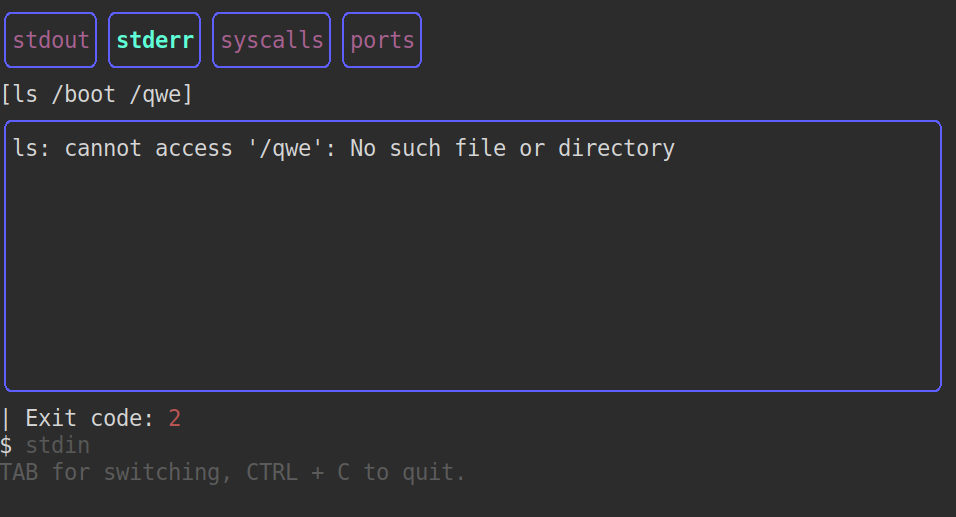

# loupe

Linux process monitor wrapper, with a TUI built with [BubbleTea](https://github.com/charmbracelet/bubbletea).




## Usage

```console
$ go mod tidy
$ go build loupe
# ./loupe command arg0 arg1 etc
```

## Pending

See Milestones and Issues.
